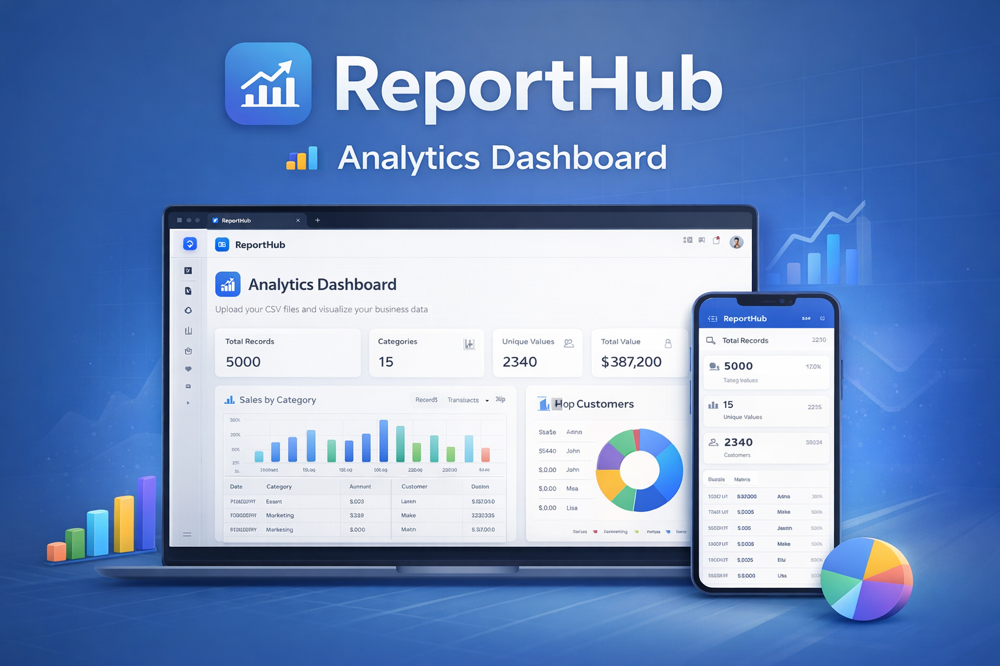

# ReportHub – Analytics Dashboard

A professional analytics dashboard web app built using Base44.

## 🚀 Features
- CSV file upload (drag and drop)
- Interactive charts (bar, line, pie)
- Data table with sorting and filtering
- Key metrics overview (records, categories, totals)
- Clean and modern dashboard UI

## 🧠 Use Case
Designed for small business owners and analysts who want quick insights
from CSV data without complex setup.

## 🔗 Live Demo
👉 https://report-hub-3eadcbb8.base44.app)

## 🛠 Platform
- Base44 (AI-assisted app builder)
- Dashboard UI/UX design
